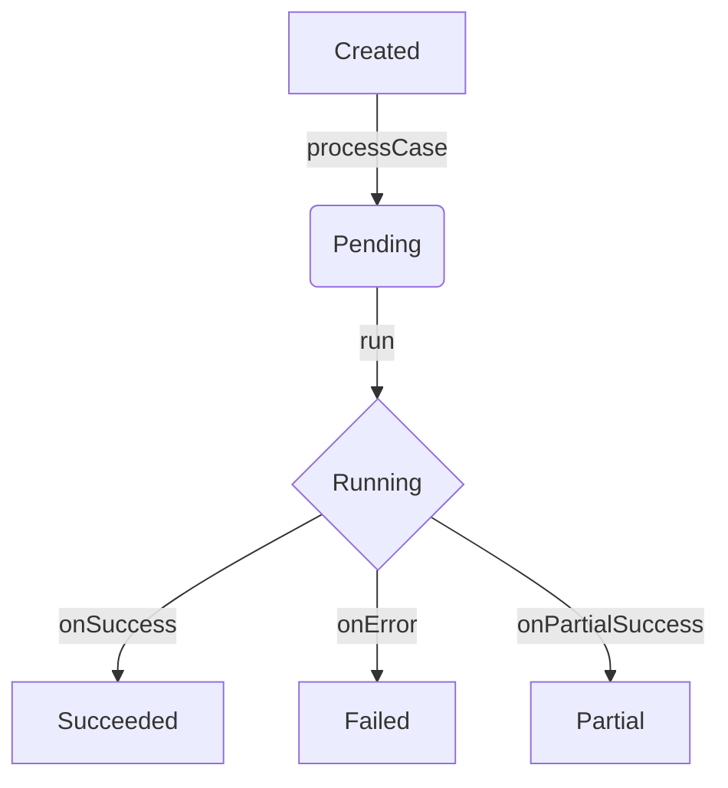

Last updated: 2025-08-21 12:05 UTC

# State and Orchestration

[Back to Master Index](./README.md)

This document outlines the central state management, lifecycle transitions, and error handling mechanisms within the AI medical coding workflow.

## Core State Types

The workflow is managed through a central state object, with key data structures defined in `oxkair-shell/lib/agents/types.ts`.

-   **`WorkflowState`**: The primary container for all data related to a single case processing instance. It is initialized when a case is created and passed through each agent in the pipeline. Each agent reads from and writes to this object.

-   **`AgentResult`**: A standardized wrapper for the output of each agent. It contains the agent's name, the evidence generated, and any errors that occurred.

-   **`Evidence`**: A structured record of a finding or action taken by an agent. All evidence is collected in `WorkflowState.allEvidence` to provide a complete audit trail of the automated process.

## State Lifecycle and Transitions

The lifecycle of a medical note's processing status is tracked in the `medical_notes.status` and `medical_notes.workflow_status` fields in the database. The in-memory `WorkflowState` reflects this during processing.

The typical state transition flow is orchestrated by the `WorkflowOrchestrator` in `oxkair-shell/lib/workflow/workflow-orchestrator.ts`.

**State Descriptions:**

1.  **Created**: A new medical note is created with a default status of `INCOMPLETE`.
2.  **Pending**: The `processCase` server action is invoked, and the workflow is queued for execution. The `workflow_status` is set to `processing`.
3.  **Running**: The `WorkflowOrchestrator` executes the agent pipeline. Each agent runs sequentially, modifying the `WorkflowState`.
4.  **Succeeded**: All agents in the pipeline complete successfully. The final data is written to the `medical_notes` table, and the `workflow_status` is marked as `complete`.
5.  **Failed**: A critical error occurs in the orchestrator or one of the agents, and the process cannot continue. The error is logged, and the `workflow_status` is set to `failed`.
6.  **Partial**: Some agents succeed, but non-critical errors occur. The partial results are saved. TODO: Verify the exact conditions for a `partial` state in the code.

## Error Handling and Resilience

-   **Retries**: TODO: The current implementation in `WorkflowOrchestrator` does not seem to include an explicit retry mechanism. This should be verified.
-   **Timeouts**: TODO: There is no explicit timeout handling at the orchestrator level. This might be handled by the underlying infrastructure (e.g., serverless function timeouts), but it's not defined in the application code.
-   **Circuit Breakers**: There is no circuit breaker pattern implemented.
-   **Evidence and Logging**: All agent activities, including errors, are captured as `Evidence` and stored in the `ai_raw_output` and `panel_data` JSONB fields of the `medical_notes` table. This provides traceability for debugging failed or partially successful runs. The `StateManager` (`oxkair-shell/lib/workflow/state-manager.ts`) provides helper functions for extracting this evidence.

## Update Checklist

When making changes to the workflow or state management, please update this document:

-   [ ] Add any new fields to the `WorkflowState` description.
-   [ ] Update the state transition diagram if the lifecycle changes.
-   [ ] Document any new error handling mechanisms (retries, timeouts).
-   [ ] Add any new core state types.
